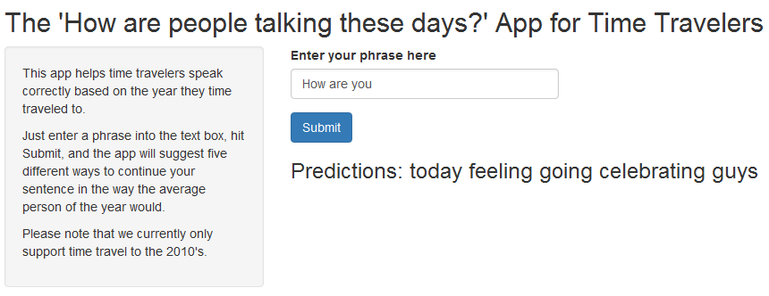

Time Traveler's Phrase Completion Companion App
========================================================
author: Daniel Hertenstein
date: February 13, 2017
autosize: true

Time Travelers Rejoice
========================================================

Time travel can be dangerous. One wrong word and you may be suspected of being a witch. Time travelers need to know the lingo of the times they travel to to ensure their safety. Studying the linguistics of a time period every time you want to time travel takes too long. There has to be a better way.

And now there is! Here at Hertenstein Technologies, we have developed a simple app to help you in every situation. Not sure how to finish your sentence? Just use our completely open source app to give you the words that you need to survive.

An Intuitive and Clean Interface
========================================================

The phrase completion app is simple to use. Here is the prototype interface. Enter the start of a phrase into the box, hit submit, and let our sophisticated algorithms write your sentences for you just like any average person of the time would. You can enter one word, two words, as much of a sentence as you can already put together, and we'll help you with what's next.



A Powerful and Simple Algorithm
========================================================

Our prediction algorithm uses an N-gram statistical model combined with a stupid backoff for unknown phrases and a modified continuation probability for settling ties.

Given an input string of length N, the last three words are fed into the prediction model. The algorithm searches the language database for 4-grams that start with the last three words of the input string. All possibilities are sorted by the number of times they appear in the database, and then by the number of times the fourth word of the 4-gram appears as the fourth word of any 4-gram. Adding this second level of sorting settles most ties in the first sorting level. The top five possibilities are then returned to the app's UI.

If there are no 4-grams that start with the last three words of the input string, we make use of a stupid backoff and look for 4-grams whose second and third terms are the last two words of the input string. If we get no matches on the bigram level, we backoff to the unigram level. If there are no unigram matches, we return the top five most common words.

If the user inputs only a single word or two words, the algorithm jumps straight to the appropriate unigram or bigram level and then uses the same procedure.

Based on Real World Data
========================================================

Our app uses text from the actual time period to construct its language models. The data for the 2010's comes from real news articles and tweets from real people.


```r
head(news, 2)
```

```
[1] "He wasn't home alone, apparently."                                                                                                                        
[2] "The St. Louis plant had to close. It would die of old age. Workers had been making cars there since the onset of mass automotive production in the 1920s."
```

```r
head(twitter, 2)
```

```
[1] "How are you? Btw thanks for the RT. You gonna be in DC anytime soon? Love to see you. Been way, way too long."  
[2] "When you meet someone special... you'll know. Your heart will beat more rapidly and you'll smile for no reason."
```
